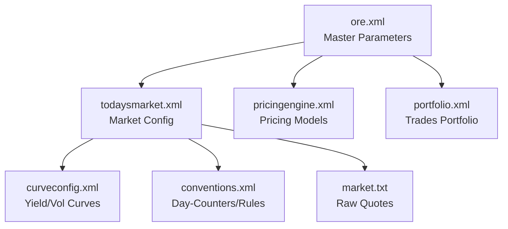

Trade ingestion is often one of the biggest challenges when adopting a new quantitative risk platform. Portfolio definitions vary considerably across trading desks, front-office systems, and vendor platforms, with each using its own conventions and data formats. To perform valuations or risk analysis in **Open Source Risk Engine (ORE)**, these trades must ultimately be translated into ORE's XML portfolio schema. This translation step is often a significant source of effort, making robust and automated trade ingestion a key requirement for any successful ORE deployment.

Once you can [bootstrap curves](/post/ore_sofr_bootstrap/) and construct a market environment, the next step is to load your trade portfolio into the engine. This post focuses on that process. The missing piece is a translation layer that converts a flat trade representation into ORE's hierarchical XML portfolio schema, producing a valid, schema-compliant portfolio ready for valuation and risk analysis.

The translation layer is deliberately independent of the underlying data source. Whether trade data originates from a CSV file, database, or API, the workflow is the same: load the data into a standard Python structure, such as a Pandas DataFrame, apply the mapping rules, and serialise the result as ORE XML. This separation keeps the translation logic reusable while allowing it to integrate with a wide range of storage and data ingestion pipelines.

The approach described here is based on work we have carried out for clients evaluating ORE as an alternative to established commercial risk platforms, as well as organisations undertaking full production migrations. In some cases, the objective was to build a proof of concept that could validate pricing and risk against an incumbent system; in others, it was to develop a robust, production-grade trade translation pipeline. Although every implementation differs, the underlying design principles remain remarkably consistent. This post focuses on those principles and the practices that have proven most effective across a range of real-world projects.

> ### Walkthrough Objectives
> In this guide, we will:
> 1. Build a Python translation adaptor using standard libraries (`pandas` and `xml.etree.ElementTree`).
> 2. Convert a flat trade file of European Equity Options into a fully schema-valid ORE XML portfolio.
> 3. Validate the generated XML portfolio against ORE's XML Schema Definitions (XSD) using `lxml`.
> 4. Price the generated portfolio using ORE's Python bindings.
>
> All scripts and configuration files used in this guide are available for download in the resources section below.

---

## 1. The Trade File — `trades.csv` {#trades-csv}

Our starting point is a standard, flat trade file representing a book of vanilla Equity Options. The CSV file (`trades.csv`) contains basic fields that any trading system would capture:

| TradeID | Counterparty | Underlying | Currency | Quantity | Strike | OptionType | LongShort | ExpiryDate | PremiumAmount | PremiumCcy | PremiumDate | ExerciseStyle |
| :--- | :--- | :--- | :--- | :--- | :--- | :--- | :--- | :--- | :--- | :--- | :--- | :--- |
| **`EQ_CALL_SP5_1`** | CPTY_A | RIC:.SPX | USD | 100.0 | 4000.0 | Call | Long | 2023-07-31 | 150.0 | USD | 2023-02-02 | E |
| **`EQ_PUT_SP5_2`** | CPTY_B | RIC:.SPX | USD | 50.0 | 4100.0 | Put | Short | 2023-07-31 | 120.0 | USD | 2023-02-02 | E |

Each row represents an option position:
* **`EQ_CALL_SP5_1`**: A long position in 100 Call options on the S&P 500 (`RIC:.SPX`) with a strike of 4000.0, expiring on 31 July 2023, with European style (`ExerciseStyle: E`).
* **`EQ_PUT_SP5_2`**: A short position in 50 Put options on the S&P 500 (`RIC:.SPX`) with a strike of 4100.0, expiring on the same date, also European style (`ExerciseStyle: E`).

While we are using a flat CSV file for this case study to keep the setup easy to follow, the source format in a production environment can be anything. Because the mapping step is decoupled from the ingestion source, you can swap this file-reading step for a SQL database connector, an API query returning JSON payloads, or a parser reading complex XML/FpML records. Once the trade parameters are loaded into a Python data structure, the downstream translation mapping logic remains identical.

---

## 2. Market Data & ORE Configuration {#market-data-config}

Before we can price these trades, we need the supporting market data and configuration infrastructure in ORE format. As detailed in our [previous ORE Curve Bootstrapping post](/post/ore_sofr_bootstrap/), ORE references market inputs using a structured, space-delimited text file (`market.txt`) representing market quotes as of our valuation date (`2023-01-31`).

For our equity options case study, the relevant quotes in `market.txt` are:

```text
2023-01-31 EQUITY/PRICE/RIC:.SPX/USD 4000.00
2023-01-31 EQUITY_FWD/PRICE/RIC:.SPX/USD/6M 4000.00
2023-01-31 EQUITY_OPTION/RATE_LNVOL/RIC:.SPX/USD/6M/ATMF 0.10
```

These quotes follow ORE's strict hierarchical format:
* **`EQUITY/PRICE/[Name]/[Currency]`**: Represents the spot price of the equity asset. Here, the S&P 500 index (`RIC:.SPX`) is priced at `4000.00` USD.
* **`EQUITY_FWD/PRICE/[Name]/[Currency]/[Tenor]`**: Represents forward equity price quotes.
* **`EQUITY_OPTION/RATE_LNVOL/[Name]/[Currency]/[Tenor]/[Strike]`**: Specifies lognormal implied volatility. In this case, it is set to a flat 10% (`0.10`) for a 6-month at-the-money forward tenor. The 6-month tenor (`6M`) corresponds directly to our trade expiry date (`2023-07-31`) from the valuation date (`2023-01-31`).

### ORE Configuration Dependency Chain
To instruct ORE how to parse these quotes and evaluate portfolios, a set of XML configurations must be passed to the engine. These configurations form a standard dependency tree:



* **`todaysmarket.xml`**: Maps our active equity curve (`RIC:.SPX`) and the discount curve (`USD-SOFR`) to the respective market quotes in `market.txt`.
* **`curveconfig.xml`**: Configures how curves are bootstrapped or loaded (e.g., flat volatility grids, interest rate discount factors).
* **`pricingengine.xml`**: Specifies the pricing engine. For `EquityOption`, it assigns the analytical Black-Scholes-Merton engine.

For a detailed review of interest rate curve bootstrapping and config construction, refer to our [previous bootstrapping post](/post/ore_sofr_bootstrap/).

---

## 3. The Target ORE Schema — `portfolio.xml` {#portfolio-xml}

ORE's portfolio file follows a consistent three-level structure:

* **`<Portfolio>`** — the root element. It contains all trades in the book.
* **`<Trade id="...">`** — one per position. Each trade carries a `<TradeType>` tag (e.g. `EquityOption`, `Swap`, `FxOption`) that tells ORE which parser to use, followed by two child blocks:
    1. **`<Envelope>`** — trade metadata: counterparty, netting set ID, and any custom additional fields.
    2. **A trade-specific data element** — for our equity options, this is `<EquityOptionData>`. For swaps it would be `<SwapData>`, for FX options `<FxOptionData>`, and so on. This block holds all the economic terms (strike, quantity, expiry, etc.).

ORE covers an exceptionally broad range of financial products, spanning vanilla and exotic interest rate, FX, equity, inflation, credit, and commodity derivatives. For a comprehensive guide detailing how this extensive product catalogue is represented and structured inside the ORE XML schema, you can refer to the [ORE Product XML Guide (products.pdf)](https://github.com/OpenSourceRisk/Engine/blob/master/Docs/products.pdf).

A single translated Call option trade inside the `<Portfolio>` schema looks like this:

```xml
<Portfolio>
  <Trade id="EQ_CALL_SP5_1">
    <TradeType>EquityOption</TradeType>
    <Envelope>
      <CounterParty>CPTY_A</CounterParty>
      <NettingSetId/>
      <AdditionalFields/>
    </Envelope>
    <EquityOptionData>
      <OptionData>
        <LongShort>Long</LongShort>
        <OptionType>Call</OptionType>
        <Style>European</Style>
        <ExerciseDates>
          <ExerciseDate>2023-07-31</ExerciseDate>
        </ExerciseDates>
        <Settlement>Cash</Settlement>
        <PremiumAmount>150.00</PremiumAmount>
        <PremiumCurrency>USD</PremiumCurrency>
        <PremiumPayDate>2023-02-02</PremiumPayDate>
      </OptionData>
      <Underlying>
        <Type>Equity</Type>
        <Name>RIC:.SPX</Name>
      </Underlying>
      <Currency>USD</Currency>
      <Quantity>100.00</Quantity>
      <Strike>4000.00</Strike>
    </EquityOptionData>
  </Trade>
</Portfolio>
```

---

## 4. Mapping CSV Fields $\rightarrow$ XML Paths {#mapping-table}

Before writing the adaptor, we establish a formal field-mapping specification:

| Source CSV Column | Target XML Path | Handling / Defaulting |
| :--- | :--- | :--- |
| **`TradeID`** | `/Trade/@id` | Unique string identifier |
| **`Counterparty`** | `/Trade/Envelope/CounterParty` | Standard counterparty mapping |
| Hard-coded | `/Trade/TradeType` | Defaulted to `"EquityOption"` |
| **`LongShort`** | `/Trade/EquityOptionData/OptionData/LongShort` | Expected: `"Long"` or `"Short"` |
| **`OptionType`** | `/Trade/EquityOptionData/OptionData/OptionType` | Expected: `"Call"` or `"Put"` |
| **`ExerciseStyle`** | `/Trade/EquityOptionData/OptionData/Style` | Mapped: `'E'` $\rightarrow$ `"European"`, `'A'` $\rightarrow$ `"American"` |
| **`ExpiryDate`** | `/Trade/EquityOptionData/OptionData/ExerciseDates/ExerciseDate` | ISO date format (`YYYY-MM-DD`) |
| Hard-coded | `/Trade/EquityOptionData/OptionData/Settlement` | Defaulted to `"Cash"` |
| **`PremiumAmount`** | `/Trade/EquityOptionData/OptionData/PremiumAmount` | Optional numerical value |
| **`PremiumCcy`** | `/Trade/EquityOptionData/OptionData/PremiumCurrency` | Optional currency code |
| **`PremiumDate`** | `/Trade/EquityOptionData/OptionData/PremiumPayDate` | Optional payment date |
| Hard-coded | `/Trade/EquityOptionData/Underlying/Type` | Defaulted to `"Equity"` |
| **`Underlying`** | `/Trade/EquityOptionData/Underlying/Name` | Asset identifier matching market config |
| **`Currency`** | `/Trade/EquityOptionData/Currency` | Trade currency |
| **`Quantity`** | `/Trade/EquityOptionData/Quantity` | Numeric quantity |
| **`Strike`** | `/Trade/EquityOptionData/Strike` | Strike price |

---

## 5. Building the Python Adaptor — `translate_trades.py` {#translate-trades-py}

Using Python's standard `xml.etree.ElementTree` and the `pandas` library, we can write `translate_trades.py` to parse the CSV and build the portfolio XML structure. 

### Step 1: Initialising and Parsing the CSV
We start by reading the trade file with `pandas`. We establish the output destination and ensure the parent directory is created.

```python
import os
import pandas as pd
import xml.etree.ElementTree as ET
from pathlib import Path

BASE_DIR = Path(__file__).parent.resolve()
CSV_PATH = BASE_DIR / "trades.csv"
OUTPUT_XML_PATH = BASE_DIR / "Input" / "portfolio.xml"

os.makedirs(OUTPUT_XML_PATH.parent, exist_ok=True)

df = pd.read_csv(CSV_PATH)
portfolio = ET.Element("Portfolio")
```

### Step 2: Mapping Rows to Trade Elements
We iterate through each row using `pd.DataFrame.iterrows()`. For each option, we map the metadata to the `<Envelope>` and structural details to `<EquityOptionData>`. Notice the `pd.notna()` check: premium data is optional in ORE, and this guard ensures we only write premium elements when all premium fields are present.

```python
for _, row in df.iterrows():
    trade_id = str(row['TradeID'])
    trade = ET.SubElement(portfolio, "Trade", id=trade_id)
    
    trade_type = ET.SubElement(trade, "TradeType")
    trade_type.text = "EquityOption"
    
    envelope = ET.SubElement(trade, "Envelope")
    cpty = ET.SubElement(envelope, "CounterParty")
    cpty.text = str(row['Counterparty'])
    
    ET.SubElement(envelope, "NettingSetId")
    ET.SubElement(envelope, "AdditionalFields")
    
    eq_opt_data = ET.SubElement(trade, "EquityOptionData")
    option_data = ET.SubElement(eq_opt_data, "OptionData")
    
    long_short = ET.SubElement(option_data, "LongShort")
    long_short.text = str(row['LongShort'])
    
    option_type = ET.SubElement(option_data, "OptionType")
    option_type.text = str(row['OptionType'])
    
    style_mapping = {'E': 'European', 'A': 'American'}
    style_code = str(row['ExerciseStyle']).strip().upper() if pd.notna(row.get('ExerciseStyle')) else 'E'
    style_val = style_mapping.get(style_code, 'European')
    
    style = ET.SubElement(option_data, "Style")
    style.text = style_val
    
    exercise_dates = ET.SubElement(option_data, "ExerciseDates")
    ex_date = ET.SubElement(exercise_dates, "ExerciseDate")
    ex_date.text = str(row['ExpiryDate'])
    
    settlement = ET.SubElement(option_data, "Settlement")
    settlement.text = "Cash"
    
    if pd.notna(row.get('PremiumAmount')) and pd.notna(row.get('PremiumCcy')) and pd.notna(row.get('PremiumDate')):
        amount = ET.SubElement(option_data, "PremiumAmount")
        amount.text = f"{float(row['PremiumAmount']):.2f}"
        ccy = ET.SubElement(option_data, "PremiumCurrency")
        ccy.text = str(row['PremiumCcy'])
        p_date = ET.SubElement(option_data, "PremiumPayDate")
        p_date.text = str(row['PremiumDate'])
        
    underlying = ET.SubElement(eq_opt_data, "Underlying")
    u_type = ET.SubElement(underlying, "Type")
    u_type.text = "Equity"
    u_name = ET.SubElement(underlying, "Name")
    u_name.text = str(row['Underlying'])
    
    currency = ET.SubElement(eq_opt_data, "Currency")
    currency.text = str(row['Currency'])
    quantity = ET.SubElement(eq_opt_data, "Quantity")
    quantity.text = f"{float(row['Quantity']):.2f}"
    strike = ET.SubElement(eq_opt_data, "Strike")
    strike.text = f"{float(row['Strike']):.2f}"
```

### Step 3: Pretty Printing and Serialisation
Standard `ElementTree` serialisation outputs flat, unformatted XML without line breaks or indentation. While syntactically valid, this is difficult to inspect.

To format the XML cleanly, we use Python's built-in `xml.dom.minidom` to re-parse the raw string and apply indentation, stripping any duplicate XML declaration:

```python
from xml.dom import minidom

def prettify(elem):
    """Return a pretty-printed XML string for the Element."""
    rough_string = ET.tostring(elem, 'utf-8')
    reparsed = minidom.parseString(rough_string)
    return reparsed.toprettyxml(indent="  ")

xml_str = prettify(portfolio)
with open(OUTPUT_XML_PATH, "w", encoding="utf-8") as f:
    lines = xml_str.split("\n")
    if lines[0].startswith("<?xml"):
        lines = lines[1:]
    f.write("\n".join(lines))

print(f"Successfully generated ORE Portfolio XML at: {OUTPUT_XML_PATH}")
```

### Step 4: Schema Validation via `input.xsd`
To ensure the translation adaptor does not generate malformed or schema-violating XML portfolios, we validate the generated output against the ORE master schema definition (`input.xsd`). 

The complete set of ORE XSD schema files can be obtained from the [official ORE repository](https://github.com/OpenSourceRisk/Engine/tree/master/xsd). Using `lxml`, we load and parse local schema files (`input.xsd`, which automatically resolves relative imports of `instruments.xsd` and `ore_types.xsd`):

```python
from lxml import etree

def validate_xml_with_local_xsd(xml_path, xsd_path):
    """Validate generated XML file against ORE's input.xsd schema."""
    schema = etree.XMLSchema(etree.parse(str(xsd_path)))
    xml_doc = etree.parse(str(xml_path))
    schema.assertValid(xml_doc)
    print("Success: Generated portfolio XML is valid against ORE schema.")
```

---

## 6. Programmatic Valuation — `run_pricing.py` {#run-pricing-py}

Once the XML portfolio is generated, we run the ORE valuation engine. Rather than executing a command-line subprocess, we use the ORE Python bindings to load configurations and trigger the run programmatically:

```python
import pandas as pd
import ORE as ore
from pathlib import Path

BASE_DIR = Path(__file__).parent.resolve()
INPUT_DIR = BASE_DIR / "Input"
OUTPUT_DIR = BASE_DIR / "Output"

if not (INPUT_DIR / "portfolio.xml").exists():
    print("Error: portfolio.xml not found. Run translate_trades.py first.")
    exit(1)

print("Running ORE Trade Pricing...")
params = ore.Parameters()
params.fromFile(str(INPUT_DIR / "ore.xml"))
app = ore.OREApp(params)
app.run()
print("--- ORE Trade Translation & Pricing Completed Successfully! ---")

df_npv = pd.read_csv(OUTPUT_DIR / "npv.csv")
print("\nCalculated NPV Results:")
print(df_npv[['#TradeId', 'TradeType', 'NPV', 'NpvCurrency']])
```

Running `run_pricing.py` prints:

```text
Running ORE Trade Pricing...
--- ORE Trade Translation & Pricing Completed Successfully! ---

Calculated NPV Results:
        #TradeId     TradeType           NPV NpvCurrency
0  EQ_CALL_SP5_1  EquityOption  10818.438615        USD
1   EQ_PUT_SP5_2  EquityOption  -8211.213933        USD
```

---

## 7. Summary & Next Steps

This workflow establishes a clean, repeatable pattern for bridging the gap between flat database schemas and ORE’s XML format. Automating the translation layer ensures consistent trade ingestion before moving to full risk and analytics runs.

> **Production Tip: Data Validation & Ingestion Guardrails**
> Real-world trade files can contain missing values, invalid currency codes, or corrupted dates. Before generating XML, consider adding a pre-validation step (e.g., using `pydantic` models or `pandas` data type assertions) to fail fast on malformed records before passing XML to ORE.

### Generalising the Translation Layer
While this guide focuses specifically on European Equity Options, the pattern scales cleanly to other asset classes. In a production risk pipeline, you can structure multi-asset trade translators using a modular dispatch architecture:

```python
# Factory pattern for multi-asset trade translation
TRANSLATORS = {
    "EquityOption": build_equity_option_xml,
    "Swap": build_swap_xml,
    "FxOption": build_fx_option_xml,
}

for _, row in df.iterrows():
    trade_type = row.get("TradeType")
    builder = TRANSLATORS.get(trade_type)
    if builder:
        builder(portfolio, row)
```

For instance:
* **Interest Rate Swaps**: Mapping input fields to ORE's `<SwapData>` and generating fixed/floating `<LegData>` structures. A basic translation script for a USD interest rate swap outputs:
  ```xml
  <SwapData>
    <LegData>
      <LegType>Fixed</LegType>
      <Payer>true</Payer>
      <Currency>USD</Currency>
      <PaymentConvention>ModifiedFollowing</PaymentConvention>
      <DayCounter>30/360</DayCounter>
      <!-- Fixed rate schedules, coupons, and notionals -->
    </LegData>
    <LegData>
      <LegType>Floating</LegType>
      <Payer>false</Payer>
      <Currency>USD</Currency>
      <PaymentConvention>ModifiedFollowing</PaymentConvention>
      <DayCounter>Act/360</DayCounter>
      <Index>USD-SOFR</Index>
      <FixingDays>2</FixingDays>
      <Spreads>0.0010</Spreads>
      <!-- Notional schedules, reset dates, and cap/floor provisions -->
    </LegData>
  </SwapData>
  ```
* **FX Options**: Generating `<FxOptionData>` blocks with underlying currency pairs, strikes, and style parameters.

The core infrastructure of handling file paths, writing the metadata envelope, and validating the portfolio against XSD schemas remains identical. 

### Source Code
All configuration files and Python scripts demonstrated in this guide are available for download:


---

### Need Help with ORE Integration?
Integrating a risk engine into an existing data landscape can be complex, involving bespoke trade representations, legacy databases, and unique market conventions. 

If you are evaluating ORE for your team or looking to implement a custom trade translation layer, feel free to **[reach out](/contact)**. We specialise in designing and building robust ORE integration layers, market data connectors, and custom validation pipelines. Let's discuss your specific product catalogue and requirements.
