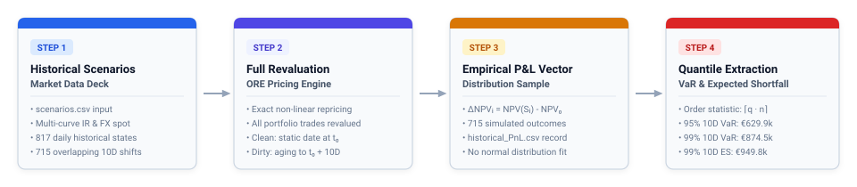
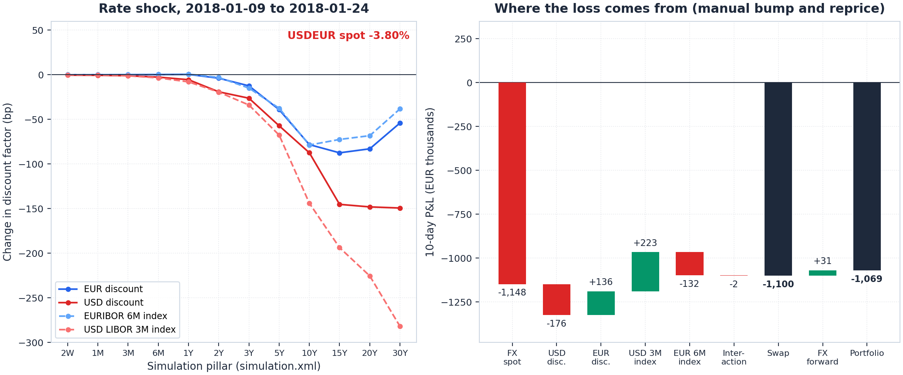
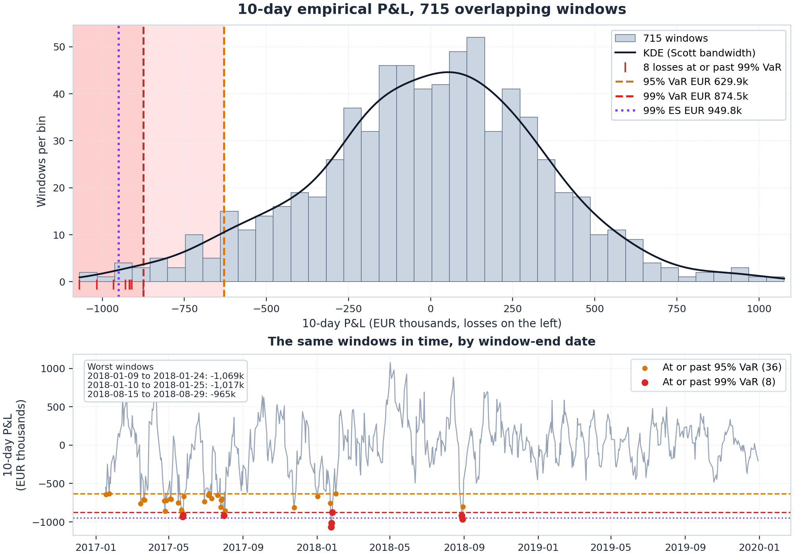
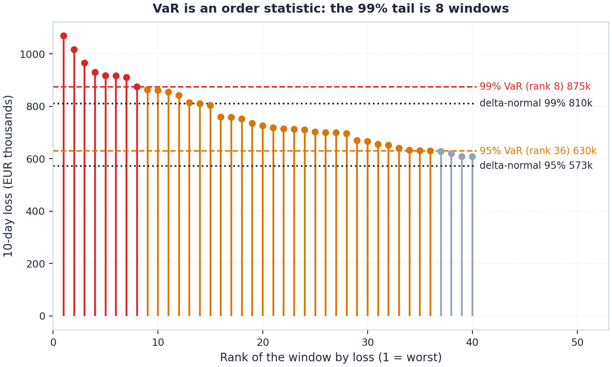
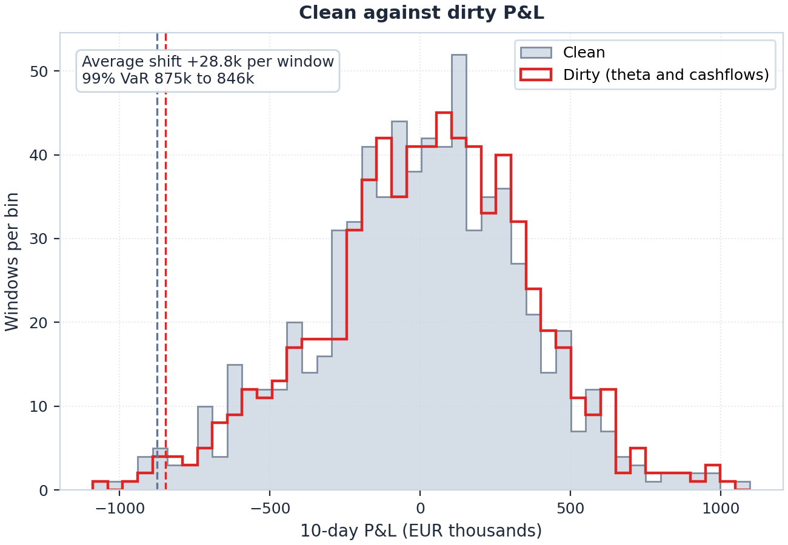

Market risk analysis usually starts with sensitivities. In [Part 3](/post/ore_sensitivity/), we looked at how ORE calculates zero and par Greeks on a simulation market grid. The next step is turning those shocks into portfolio Value at Risk (VaR). Historical VaR is simple in concept but messy in practice. You have to generate consistent historical scenarios, reprice every trade across hundreds of windows, and decide how to handle holding periods, cash flows, and time decay.

In this post, we walk through ORE's historical simulation VaR (HistSim VaR) analytic end to end. Using a two-trade cross-currency book, we run full revaluation across 715 historical windows to compute a 99% 10-day VaR of EUR 874.5k. To see how ORE actually does the math, we re-implement its scenario interpolation and repricing logic by hand in Python, match ORE's window P&L to the exact cent, verify the tail quantiles, and compare the empirical output with parametric benchmarks.

Like earlier posts in the series, you do not need a C++ build environment. You can install ORE and follow along directly in Python:

```bash
pip install open-source-risk-engine matplotlib pandas numpy
```

This is Part 4 of the ORE Fundamentals series, building on the curve construction in [Part 1](/post/ore_sofr_bootstrap/), trade valuation and validation in [Part 2](/post/ore_model_validation/), and portfolio Greeks from [Part 3](/post/ore_sensitivity/).

---

## 1. The idea

VaR estimates the loss over a holding period exceeded with probability $p$, such as $1 - \alpha = 1\%$ for a 99% confidence level. A 99% 10-day VaR of EUR 874.5k means that across our historical 10-day evaluation windows, only 1% produced a portfolio loss greater than that amount. Throughout this post, we quote VaR as a positive loss number, while keeping raw P&L vectors in standard accounting sign convention where losses are negative.

The historical simulation workflow consists of four steps:

1. **Collect scenarios.** `scenarios.csv` holds 817 daily market states from 2016-09-01 onwards. Windows ending between 2017-01-17 and 2019-12-30 enter the calculation. A 10-business-day horizon across that range gives 715 overlapping windows.
2. **Shock today's market.** Each window defines a relative shift that ORE applies to the base market as of 2019-12-30.
3. **Reprice everything.** Every trade is repriced from scratch in the shocked market. This is a full revaluation, with no delta-gamma or Taylor series approximations.
4. **Read the quantile.** Sort the 715 simulated P&L outcomes. The 99% VaR is the 8th worst loss ($\lceil 0.01 \times 715 \rceil = 8$), the 95% VaR is the 36th worst ($\lceil 0.05 \times 715 \rceil = 36$), and Expected Shortfall (ES) is the average of those 8 worst losses.



For window $i$, with base market $\mathcal{M}_0$, shocked market $\mathcal{M}_i$, and horizon $t_1 = t_0 + \Delta t$, ORE can report two P&L definitions:

$$ \Delta V^{\text{clean}}(i) = V(t_0, \mathcal{M}_i) - V(t_0, \mathcal{M}_0) $$

$$ \Delta V^{\text{dirty}}(i) = V(t_1, \mathcal{M}_i) - V(t_0, \mathcal{M}_0) + \text{CF} $$

Clean P&L holds the valuation date fixed and moves only market risk factors. Dirty P&L ages trades forward over the holding period and accounts for cash flows paid or received in between. Section 9 compares the two. All preceding sections assume clean P&L.

---

## 2. The book

Our test book contains two trades, defined in [`portfolio.xml`](Input/HistSimVar/portfolio.xml):

- **`XCCY_Swap_EUR_USD`.** Pays EURIBOR 6M on EUR 30M and receives USD LIBOR 3M on USD 33.9M, from 2012-09-05 to 2025-09-05, with notional exchanged at both ends. ORE models this as a `Swap` with two floating legs.
- **`FXFWD_EURUSD_10Y`.** Buys EUR 1M against USD 1.1M, cash settled on 2029-03-01.

Because both trades are linear, full revaluation and delta-gamma approximations give identical results here. We chose linear trades deliberately so we could audit every number by hand. Section 10 revisits options and nonlinear payoffs.

Foreign exchange dominates the book. Both final notional exchanges involve fixed amounts of USD. Shocking USDEUR spot by 1% shifts portfolio value by about EUR 294k, far exceeding the impact of any single rate curve shift in our sample. That EUR 294k delta gives an intuitive baseline for our sanity check in Section 8.

---

## 3. What ORE does with the scenario file

In [Part 3](/post/ore_sensitivity/), we constructed a `ScenarioSimMarket`, a discretized grid of yield curve pillars and FX spots. While sensitivity analysis bumped one grid point at a time to evaluate partial derivatives, historical simulation shifts all grid points simultaneously to replay joint historical moves.

[`simulation.xml`](Input/HistSimVar/simulation.xml) defines this simulation grid. It has EUR and USD discount curves at 12 pillars from 2W to 30Y, the EUR-EONIA, EURIBOR 3M and 6M, USD-FedFunds and USD-LIBOR-3M index curves, and USDEUR spot. Each row of [`scenarios.csv`](Input/HistSimVar/scenarios.csv) gives the value of every grid point on one historical date:

```csv
Date,Scenario,Numeraire,DiscountCurve/EUR/0,...,DiscountCurve/USD/0,...,IndexCurve/EUR-EURIBOR-6M/1,...,FXSpot/USDEUR/0
01/09/2016,1,1,1.00013288,...,0.9996784,...,1.0000751,...,0.8929
```

The values are absolute discount factors from each date to the pillar date. They are not rates, and they are not changes. The trailing index counts pillars, so `/0` is 2W and `/11` is 30Y. The last row, 2019-12-30, equals the base market, which confirms the file aligns with the as-of date.

---

## 4. Replicating historical P&L by hand in Python

The pipeline sounds straightforward, but reconciling it to production precision requires care with conventions. To see how ORE converts scenario discount factors into portfolio P&L, we replicate the engine's mechanics from scratch in Python using NumPy ([`manual_bump.py`](manual_bump.py)). ORE provides only the static base market and initial swap schedule. All scenario shifts, curve reconstructions, and trade repricings run independently in Python.

The recipe mirrors ORE's internal execution:

1. Take two rows from `scenarios.csv`, window start date $d_1$ and end date $d_2$.
2. Divide row $d_2$ by row $d_1$, pillar by pillar. That ratio forms the factor shock. FX spot follows the same logic.
3. Multiply ORE's base discount factor at each pillar by its corresponding ratio, and the base FX spot quote by the FX ratio.
4. Rebuild each curve across pillars. Full curve re-bootstrapping under each scenario would be computationally intensive, so ORE takes the 12 simulation market pillars directly and applies log-linear interpolation on discount factors with $DF(0) = 1$.
5. Reprice the portfolio. Each floating coupon projects forward rates from the shocked index curve using the index's native value and maturity dates. Cash flows discount along the shocked discount curves, and foreign-currency flows convert to EUR at the curve-adjusted forward FX rate.
6. Subtract the base NPV to obtain window P&L.

The core Python calculation logic reduces to:

```python
ratios = scen.loc[d2, cols].to_numpy() / scen.loc[d1, cols].to_numpy()   # one curve, 12 pillars
shocked_df = base_df * ratios                                            # pillar by pillar
spot = fx0 * fx_ratio                                                    # raw quote, shocked
fx = spot * df(shocked_eur, t_spot) / df(shocked_usd, t_spot)            # what ORE converts USD at
fwd = (df(shocked_idx, v) / df(shocked_idx, e) - 1) * accrual / span     # v, e, span from index conventions
```

`scenarios.csv` stores discount factors, not zero rates. If you shock them additively by taking differences, you will not reconcile with ORE. Because zero-rate shifts compound exponentially, discount factors scale multiplicatively by their ratio, $DF_2 / DF_1$. Applying additive shifts leads to P&L discrepancies of up to EUR 7.7k in individual windows, averaging EUR 1.5k, with 387 of 715 windows off by more than EUR 1k. Multiplicative scaling aligns with ORE to the penny.

The worst window is 2018-01-09 to 2018-01-24. Over those ten days USDEUR fell 3.8%, so USD assets lost value in euros, and long-dated rates moved too.



The left panel is the shock ORE applies. The right panel reprices the swap with one risk factor shocked at a time, then with all of them together. FX spot explains more than the whole loss, and the rate factors partly cancel.

| 2018-01-09 to 2018-01-24 | Manual | ORE | Difference |
| :--- | ---: | ---: | ---: |
| `XCCY_Swap_EUR_USD` | -1,099,887 | -1,099,887 | 0 |
| `FXFWD_EURUSD_10Y` | +30,742 | +30,742 | 0 |
| Portfolio | -1,069,145 | -1,069,145 | 0 |

Then run all 715 windows through the same code. The largest difference in any window is one cent.

| | Manual | ORE | Difference |
| :--- | ---: | ---: | ---: |
| 95% VaR | 629,899 | 629,899 | 0 |
| 99% VaR | 874,503 | 874,503 | 0 |
| 99% expected shortfall | 949,846 | 949,846 | 0 |

Getting there took four alignments. The first two are visible in the config. The last two came from the per-pillar attribution in `riskFactor_PnL.csv`, which showed exactly where the manual numbers parted from ORE's:

1. **Curve grid.** In `simulation.xml`, ORE defines pillar dates as unadjusted calendar additions (`asof + tenor`), not business-day-rolled dates. A 10Y pillar sits at `2029-12-30`, one day before the calendar-adjusted date in the pricing report.
2. **Cashflow conventions.** The stub coupon (March 2020) fixed before the as-of date, so its amount is deterministic (-EUR 65.4k and +USD 161.5k) and does not float with scenario curves. At maturity, the final notional exchange (-EUR 30M and +USD 33.9M) discounts to $t_0$.
3. **FX conversion uses the shocked curves.** ORE does not convert USD at the raw spot quote. It converts at $S \times DF_{EUR}(t_{spot}) / DF_{USD}(t_{spot})$ on the simulated curves, where spot is T+2 on the joint calendar, 2020-01-02 here. That is how `flows.csv` gets 0.89310 from a quote of 1/1.1199 = 0.89294. It also means the 2W pillars of both discount curves move every USD flow. In the December 2017 windows, for example, the USD 2W discount factor moved by 26 bp; ORE attributes EUR 16.7k of P&L to that pillar, whereas holding the conversion rate at `spot * ratio` attributes zero. That basis explains why naive spot conversions diverged by up to EUR 17k.
4. **Floating coupons project over the index dates, not the accrual dates.** With at-par coupons, QuantLib takes the forward from the index value date (fixing date plus the index's two fixing days on its own calendar) to the accrual end shifted by the same amount. It divides by the index day-count spanning time and then multiplies by the accrual. The projected coupon is $N \cdot \alpha \cdot (DF(v)/DF(e) - 1) / \tau$. Using raw accrual dates costs up to about 0.5% of the index-curve sensitivity at the 5Y pillar, which shows up as a few hundred euros per window.

ORE's simulation market base NPV differs from the valuation reported in `npv.csv`. The simulation market interpolates across 12 discrete pillars, whereas today's market pricing uses the full bootstrapped curve. As a result, the swap is valued at -EUR 4,177 in the simulation market versus -EUR 2,267 in the standard pricing report. Scenario P&L is measured relative to the simulation market baseline. Referencing the full pricing report PV instead introduces an artificial basis mismatch between base and shocked valuations.

Once you account for multiplicative discount factor ratios, spot settlement adjustments, and index fixing calendars, historical simulation VaR is completely transparent. It is 715 repricings followed by an empirical sort.

---

## 5. Running it in ORE

The calculation is configured in [`ore_histsimvar.xml`](Input/ore_histsimvar.xml). Key parameters controlling the run include:

```xml
<Analytic type="historicalSimulationVar">
  <Parameter name="historicalScenarioFile">scenarios.csv</Parameter>
  <Parameter name="simulationConfigFile">simulation.xml</Parameter>
  <Parameter name="historicalPeriod">2017-01-17,2019-12-30</Parameter>
  <Parameter name="mporDays">10</Parameter>
  <Parameter name="mporOverlappingPeriods">true</Parameter>
  <Parameter name="quantiles">0.01,0.05,0.95,0.99</Parameter>
  <Parameter name="includeExpectedShortfall">Y</Parameter>
  <Parameter name="includeTheta">N</Parameter>
  <Parameter name="includePeriodCashflow">N</Parameter>
  <Parameter name="tradePnl">Y</Parameter>
  <Parameter name="riskFactorBreakdown">Y</Parameter>
</Analytic>
```

- `historicalPeriod`: Sets the range of window-end dates. The initial window spans 2016-12-30 to 2017-01-17, accounting for the 2017-01-16 USD holiday.
- `mporDays`: Holding period in business days, counted on the designated `mporCalendar` (USD).
- `mporOverlappingPeriods`: Set to `true` to start a new 10-day window on every business day. Setting this to `false` creates contiguous, non-overlapping 10-day blocks. While non-overlapping windows provide independent observations, they reduce sample size tenfold, down to 71 observations, which is statistically inadequate for estimating a 99% quantile.
- `includeTheta` and `includePeriodCashflow`: Toggle between clean and dirty P&L.

[Appendix A](#appendix-a-parameter-reference) lists the remaining parameters. Run the calculation from the post folder:

```bash
python run_histsimvar.py           # clean VaR
python run_histsimvar.py --dirty   # theta and cashflows included
```

[`run_histsimvar.py`](run_histsimvar.py) loads the XML, executes `ORE.OREApp`, and prints the portfolio row of `var.csv`. It also recomputes the same metrics directly from `historical_PnL.csv` as an independent verification. The complete run takes approximately one minute.

| | 95% 10-day VaR | 99% 10-day VaR | 99% ES |
| :--- | ---: | ---: | ---: |
| Portfolio, full revaluation | EUR 629,899 | EUR 874,503 | EUR 949,846 |

`var.csv` stores quantiles in raw P&L convention, where losses are negative. The 8th worst window defines the 99% VaR and the 36th worst defines the 95% VaR, reconciling with ORE's reported values to the exact euro.

In this ORE release, the standalone `RiskClass` summary rows for `InterestRate` and `FX` in `var.csv` and `historical_PnL.csv` replicate total portfolio figures rather than isolating single-asset-class risk. To obtain a true risk attribution, we enable the granular risk factor breakdown discussed in Section 7.

---

## 6. Reading the distribution



The top panel plots the 715 window P&Ls across 40 bins alongside an overlaid Gaussian KDE curve. Dashed lines mark 95% VaR (EUR 629.9k) and 99% VaR (EUR 874.5k), while the dotted purple line indicates 99% Expected Shortfall (EUR 949.8k, the average of the 8 worst losses). With a mean of -EUR 10.1k and a median of +EUR 11.2k, the empirical distribution is skewed to the left.

The bottom panel plots the returns chronologically by window end date. This timeline shows what the histogram hides. The 36 windows breaching 95% VaR arrive in distinct clusters. The 8 windows driving 99% VaR trace back to four market episodes: May 2017 with 2 windows, July 2017 with 1, January 2018 with 3, and August 2018 with 2. Because overlapping windows reuse daily market moves, a single volatile week generates multiple tail observations. Our 99% VaR estimate reflects four macroeconomic events rather than eight independent shocks.

---

## 7. Decomposing tail risk by factor

Setting `riskFactorBreakdown` to `Y` writes `riskFactor_PnL.csv`. ORE shocks one risk factor at a time, at each pillar, and reprices the trade. The resulting file contains 29,873 rows across 35 risk factor keys, such as `DiscountCurve/USD/7`.

Aggregated by curve for the swap in the worst window (2018-01-09 to 2018-01-24), these rows match our manual one-factor-at-a-time repricing from Section 4:

| Swap, 2018-01-09 to 2018-01-24 | Manual | ORE |
| :--- | ---: | ---: |
| FX spot | -1,147,956 | -1,147,956 |
| USD discount | -176,217 | -176,217 |
| EUR discount | +135,678 | +135,678 |
| USD LIBOR 3M index | +222,922 | +222,922 |
| EURIBOR 6M index | -132,092 | -132,092 |
| Sum of the factors | -1,097,664 | -1,097,664 |
| All factors shocked together | -1,099,887 | -1,099,887 |

The EUR 2.2k gap between the sum of individual factor P&Ls and the joint shock represents cross-factor convexity, or cross-gamma, interaction, which remains negligible because the underlying book is linear.

We can also run the 715 windows shocking one risk class at a time. Shocking only FX spot yields a 99% standalone VaR of EUR 884k. Shifting interest rate curves alone produces a 99% VaR of EUR 63k.

The total portfolio VaR of EUR 875k is lower than the standalone FX VaR. During extreme dollar depreciation windows in this lookback, interest rate movements cushioned the FX losses. In the worst window, interest rate moves contributed +EUR 49k against the -EUR 1,117k FX loss.

---

## 8. Does the number make sense?

Before trusting a simulation engine, check the number with a back-of-the-envelope calculation. Because FX spot dominates portfolio risk, an independent benchmark is straightforward:

1. **Portfolio delta.** The book has a net USD exposure of EUR 29.4M, translating to EUR 294k per 1% move in USDEUR spot, verified by a finite difference repricing at $\pm 1\%$.
2. **Historical volatility.** Across the 715 historical windows, the sample standard deviation of 10-day USDEUR log-returns is 1.184%.
3. **Parametric VaR.** Under a normal distribution, the 99% one-tailed quantile corresponds to $z_{0.99} = 2.326$. Multiplying gives $2.326 \times 0.01184 \times \text{EUR } 29.4\text{M} \approx \text{EUR } 810\text{k}$.

| Method | 95% | 99% |
| :--- | ---: | ---: |
| Delta-normal, 10-day vol from the windows (1.184%) | EUR 573k | EUR 810k |
| Delta-normal, daily vol $\times \sqrt{10}$ (1.332%) | EUR 644k | EUR 911k |
| Historical, FX only | EUR 637k | EUR 884k |
| Historical, rates only | EUR 47k | EUR 63k |
| Historical, full book (ORE) | EUR 630k | EUR 875k |



Both parametric benchmarks land within ~10% of ORE's full historical revaluation. An order-of-magnitude error or a 2x gap would indicate an operational defect or missing risk factor. A 10% spread reflects expected distributional differences.

Two differences stand out:

- **Fat tails.** The parametric normal estimate using realized 10-day volatility is 7% lower at 99%, at EUR 810k compared to EUR 875k, because empirical FX returns have fatter tails than a Gaussian distribution.
- **Mean reversion vs. $\sqrt{t}$ scaling.** Scaling 1-day volatility by $\sqrt{10}$ overshoots 99% VaR by 4%, at EUR 911k compared to EUR 875k. In this 3-year sample, realized 10-day moves were roughly 11% less volatile than an i.i.d. random walk implies. The conventional $\sqrt{t}$ scaling rule is an active modelling assumption rather than an identity. Many legacy risk systems scale 1-day VaR by $\sqrt{10}$ purely because multi-day simulation is computationally expensive. Historical simulation in ORE sidesteps this shortcut by measuring multi-day holding period returns directly.

---

## 9. Clean and dirty VaR

Switching `includeTheta` and `includePeriodCashflow` to `Y` rolls the valuation date forward ten days and adds intermediate cash flows that fall within the window. [`ore_histsimvar_dirty.xml`](Input/ore_histsimvar_dirty.xml) enables both flags.

| | Clean | Dirty | Change |
| :--- | ---: | ---: | ---: |
| 95% VaR | EUR 629,899 | EUR 601,136 | -28,763 |
| 99% VaR | EUR 874,503 | EUR 846,346 | -28,158 |
| 99% expected shortfall | EUR 949,846 | EUR 921,659 | -28,187 |



Dirty P&L is higher by EUR 28.8k on average, which shifts the entire distribution to the right and reduces each tail risk measure by roughly EUR 28k. This shift comes mainly from positive net carry. Receiving ~1.9% on USD and paying ~-0.4% on EUR on comparable notionals yields approximately EUR 19k in net interest accrual over ten days. The remaining EUR 9.8k comes from discount-curve theta roll-down.

Which definition you use depends on the objective. Clean VaR isolates market risk on a static portfolio, holding trade age and cash flows invariant. Dirty VaR incorporates theta decay and cash flows, matching what the desk's P&L ledger experiences over the holding period. Regulatory backtesting frameworks such as Basel III and FRTB prescribe specific comparisons between hypothetical and actual P&L, making it practical to switch between both modes in ORE.

---

## 10. Limits of this example

- **Linear portfolio.** Full revaluation is designed to capture nonlinear payoffs such as gamma and vega, which a swap and forward portfolio does not exercise. Adding FX options or swaptions and benchmarking against delta-gamma VaR is the natural next step.
- **Static curves.** The simulation market in this setup shocks yield curves and FX spot. Volatility surfaces are not part of this simulation grid, so option portfolios would require extending `simulation.xml` to model smile dynamics.
- **Single lookback window.** We used three years of equally weighted daily observations with a single cutoff. In production, risk managers frequently calibrate exponentially weighted historical simulation or dedicated stressed VaR windows to address tail clustering.
- **FX precision.** `scenarios.csv` stores USDEUR spot quotes to four decimal places in this example dataset, so 10-day moves smaller than 0.5 pips round to zero. This affects only a handful of near-flat windows and does not impact tail quantiles.

Pricing, curve calibration, and sensitivities can be handled by many quantitative libraries. Historical simulation is where an engine gets tested as a portfolio system. Repricing a book across hundreds of historical market states, with clean handling of multi-day horizons, intermediate cash flows, and theta decay, is what turns pricing models into a functional risk framework.

### Need help with ORE integration?

If you are evaluating ORE for your market risk workflow, setting up an initial installation, or benchmarking historical simulation and backtesting pipelines against your existing systems, feel free to **[reach out](/contact)**. We specialise in ORE integrations, bespoke pricing pipelines, and model validation.

---

## Appendix A. Parameter reference

| Parameter | Value | What it does |
| :--- | :--- | :--- |
| `historicalScenarioFile` | `scenarios.csv` | Historical market states on the `simulation.xml` grid |
| `simulationConfigFile` | `simulation.xml` | Grid of curves, tenors and FX pairs |
| `historicalPeriod` | `2017-01-17,2019-12-30` | First and last window-end dates |
| `mporDays` | `10` | Holding period in business days |
| `mporCalendar` | `USD` | Calendar used to count those days |
| `mporOverlappingPeriods` | `true` | New window every day, or back-to-back blocks |
| `quantiles` | `0.01,0.05,0.95,0.99` | Left tail gives losses, right tail gives gains |
| `includeExpectedShortfall` | `Y` | Writes $\mathbb{E}[L \mid L \ge \text{VaR}]$ next to each quantile |
| `includeTheta` | `N` | `Y` moves the pricing date to $t_1$ |
| `includePeriodCashflow` | `N` | `Y` adds cash flows paid between $t_0$ and $t_1$ |
| `breakdown` | `Y` | Adds `RiskClass` and `RiskType` rows (see note in Section 5) |
| `tradePnl` | `Y` | Per-trade P&L in `historical_PnL.csv` |
| `riskFactorBreakdown` | `Y` | Per-factor P&L in `riskFactor_PnL.csv` |

`RiskType` is `All` for full revaluation and `DeltaGamma` for the sensitivity approximation. The two are identical here because the book is linear.

## Appendix B. Files

All configuration XMLs, scenario market files, and Python scripts used in this post are packaged for download:



- [`run_histsimvar.py`](run_histsimvar.py) runs the analytic and prints VaR from `var.csv` and from `historical_PnL.csv`.
- [`manual_bump.py`](manual_bump.py) reprices every window by hand and checks it against ORE.
- [`plot_var_results.py`](plot_var_results.py) draws the figures.
- [`var_common.py`](var_common.py) holds the shared quantile and report helpers.
- [`Input/ore_histsimvar.xml`](Input/ore_histsimvar.xml), [`Input/ore_histsimvar_dirty.xml`](Input/ore_histsimvar_dirty.xml) and [`Input/ore_base.xml`](Input/ore_base.xml) are the three ORE configs. The last one dumps the base NPVs, cashflows and pillar discount factors that `manual_bump.py` reads.
